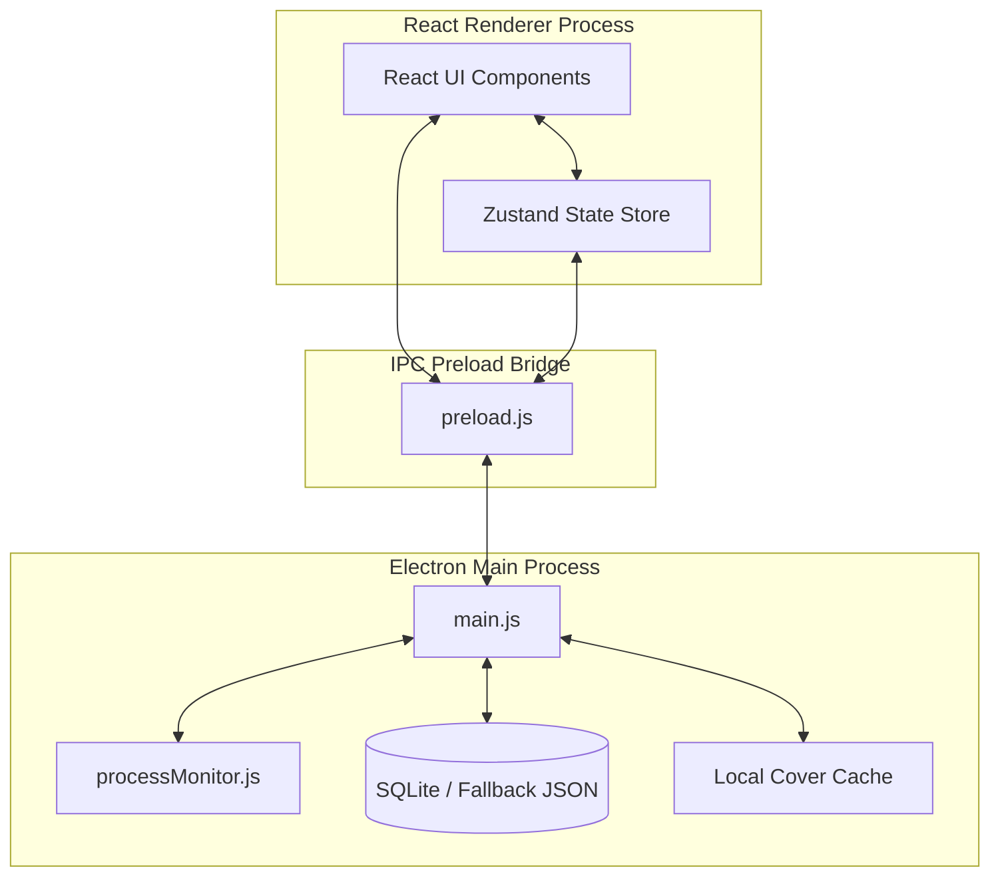
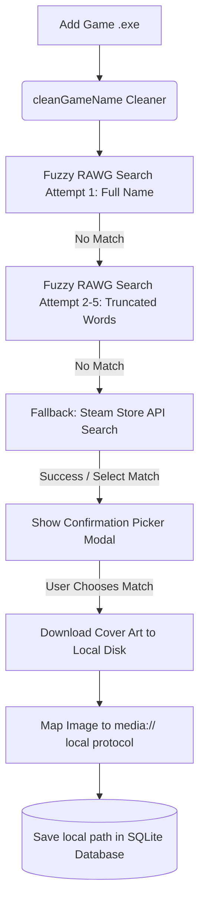
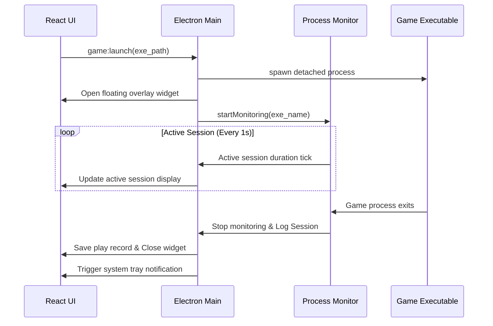

<p align="center">
  
</p>

#  VaultTrack

VaultTrack (STRAFE) is a premium, beautifully crafted local game library manager and session tracking application designed for PC players. Inspired by the visual aesthetics of **Raycast, Arc Browser, and high-end audio apps like Doppler**, it combines dense information layouts with warm, tactile color schemes (terracotta, off-white, and charcoal) to offer a dashboard you actually want to keep open on your desktop.

🔗 **GitHub Repository**: [prathameshfuke/Strafe](https://github.com/prathameshfuke/Strafe)

---

## 🎨 Core Design Philosophy

- **Warm and Tactical Aesthetic**: Clean layouts using dynamic off-whites, terracotta accents, and soft secondary amethysts. Surfaces feel like brushed metal or warm paper rather than dark neon or generic blue corporate tools.
- **Content-First Layout**: Beautiful grid and list views showing game covers, rating scales, status badges, and precise playtimes.
- **Zero Clutter**: Keyboard-first spacing feel, dense but readable sections, and smooth transition animations.

---

## ⚡ System Architecture

VaultTrack uses a modern multi-process architecture utilizing Electron, React, and local persistence.



---

## 🚀 Features & Data Flows

### 1. Game Metadata Search & Local Image Caching
When a game is added (manually or via file dropping), the system automatically cleans the filename and initiates a multi-stage search query. Images are cached locally on disk to protect API quotas and ensure instant rendering in offline mode.



### 2. Auto-Playtime Process Monitor
Launching a game from VaultTrack spawns a detached child process, hides the main window, opens a compact overlay widget, and begins process tracking.



---

## 📊 Database Schema

VaultTrack structures your local data across several tables:

| Table | Purpose | Key Fields |
|---|---|---|
| **`profile`** | User gaming identity & profile metadata | `username`, `avatar_path`, `bio`, `age`, `favorite_genre`, `is_onboarded` |
| **`games`** | Details for indexed library games | `id`, `name`, `exe_path`, `cover_art` (local `media://` url), `genre`, `rating` |
| **`sessions`** | Playtime records and journal logs | `id`, `game_id`, `start_time`, `end_time`, `duration_seconds`, `notes` |
| **`achievements`**| Custom unlockable badges per game | `id`, `game_id`, `name`, `description`, `rarity`, `unlocked`, `unlocked_date` |
| **`collections`** | User-defined custom folders/groups | `id`, `name`, `color`, `icon` |

---

## ⚙️ Running the Project Locally

Ensure you have [Node.js](https://nodejs.org) installed.

### 1. Install Dependencies
```bash
npm install
```

### 2. Start Development Server
Starts the Vite dev server and launches the Electron application in hot-reload mode:
```bash
npm run dev
```

---

## 📦 Building the App

To compile the React frontend and package the Electron desktop application into a standalone Windows installer (`.exe`), run:

```bash
npm run package
```

The resulting setup installer will be generated inside the `release/` directory (e.g., `release/STRAFE Setup 1.0.0.exe`).
