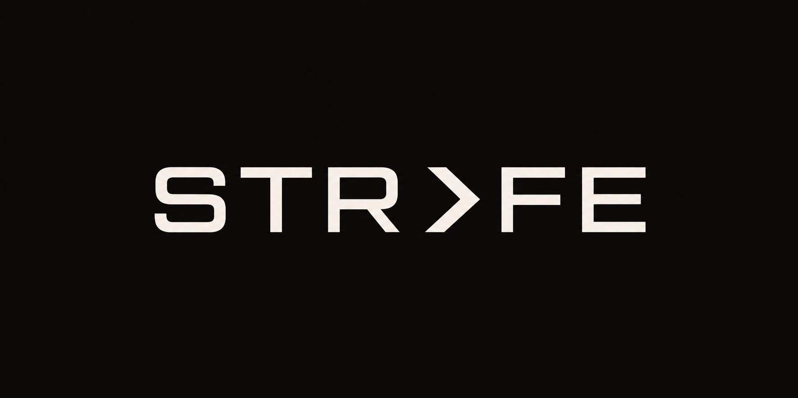

<p align="center">
  
</p>

#  VaultTrack

VaultTrack is a premium, beautifully crafted game library manager and session tracking application designed for PC players. Inspired by the visual aesthetics of **Raycast, Arc Browser, and high-end audio apps like Doppler**, it combines dense information layout with tactile warm colors (terracotta & off-white) to offer a dashboard you actually want to leave open.

🔗 **GitHub Repository**: [prathameshfuke/Strafe](https://github.com/prathameshfuke/Strafe)

---

## Core Design Philosophy

- **Warm and Tactical**: Clean layouts using dynamic off-whites, terracotta, and soft secondary amethysts. Surfaces feel like brushed metal or warm paper rather than dark neon or generic blue corporate tools.
- **Content-First**: Beautiful catalog layouts showing game covers, status badges, and precise playtimes.
- **No Clutter**: Zero useless widgets. Every button, badge, toggle, and chart is built with intention.

---

## Features

1. **Player Onboarding and Profile**:
   - Initialize a local gaming identity directly on your device.
   - Enter your name, age, bio, and favorite genre. 
   - Completely local: no server or third-party authentication required.
2. **Library Management**:
   - Add games via file path.
   - Drag and drop `.exe` files onto the page to quickly add them.
   - Metadata integration powered by RAWG API: fetches descriptions, covers, genres, developers, and more.
3. **Game Launcher and Session Watcher**:
   - Run games directly from VaultTrack.
   - Automatic background tracking monitors the game process, logging precise playtime down to the second.
   - Saves logs inside the journal with custom session notes.
4. **Rich Statistics and Heatmaps**:
   - Activity heatmaps (similar to GitHub contributions) showing your playing patterns.
   - Detailed Recharts analysis of favorite genres, playtimes over time, and streak counters.
5. **Shareable Profile Cards**:
   - Export premium PNG cards with your customized gaming details, stats, top games, and status.

---

## Architecture and Tech Stack

- **Front-end**: React 19, Vite, Zustand, Tailwind CSS, Lucide icons, Recharts
- **Container**: Electron (frameless layout, custom title bar actions, native window controls)
- **Database Persistence**:
  - Primary: `better-sqlite3` database file stored securely in local app data.
  - Fallback: Local JSON database backup if native SQLite driver is missing or blocked.
  - Process Monitoring: Native child process spawning and process polling/monitoring in Node.js.

---

## Running the Project

Ensure you have [Node.js](https://nodejs.org) installed.

### 1. Install Dependencies
```bash
npm install
```

### 2. Start Development Server
This starts the Vite dev server and launches the Electron application pointing to localhost:
```bash
npm run dev
```

### 3. Build Production Bundle
To build both Vite production assets and package the Electron app executable:
```bash
npm run build
```

---

## Database Schema

VaultTrack structures your local data across several tables:

- **`profile`**: Stores user identity (username, avatar, bio, age, favorite genre, status, and onboarding flag).
- **`games`**: Details for each indexed game (name, executable path, cover art, genre, rating, and favorite status).
- **`sessions`**: Logged playtime sessions (start time, end time, total duration, and session journal comments).
- **`achievements`**: Custom achievement definitions and unlocked dates per game.
- **`collections`**: Custom collections (e.g. Backlog, Favorites) created by the user.
- **`collection_games`**: Many-to-many relationship mapping games to collections.
