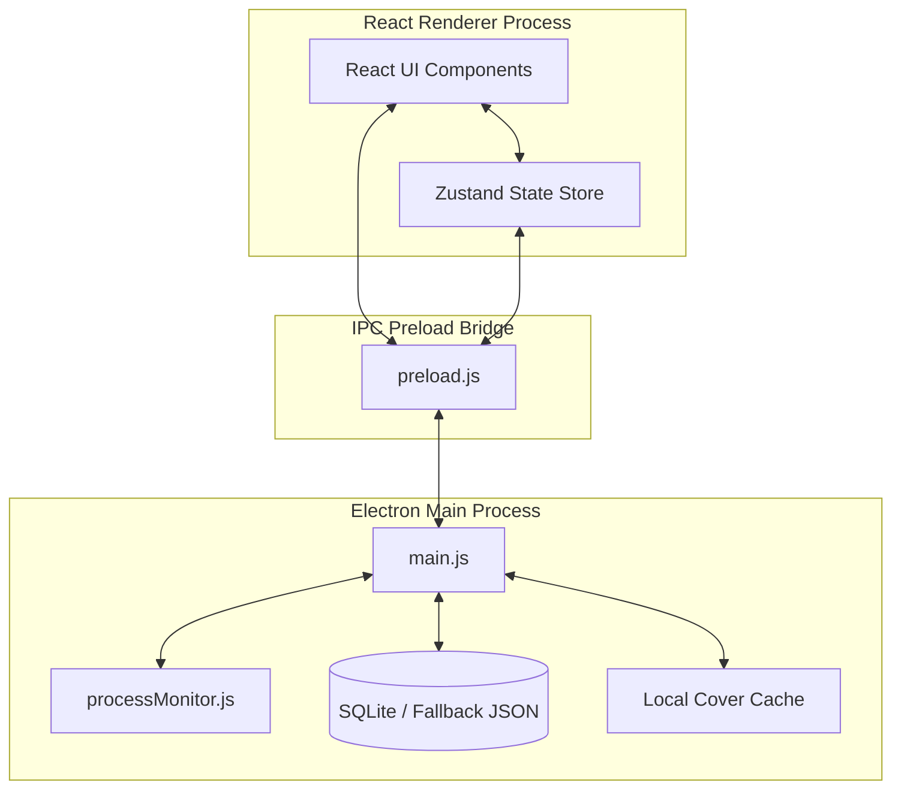
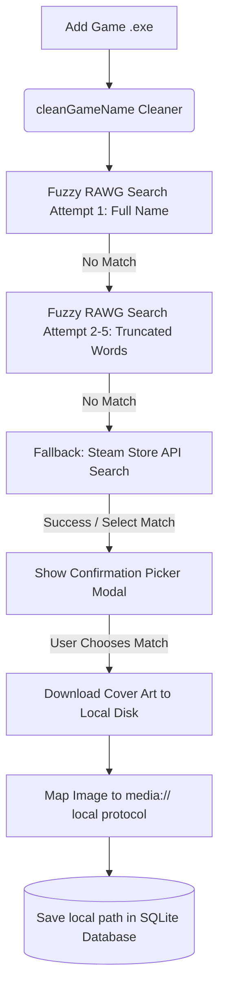
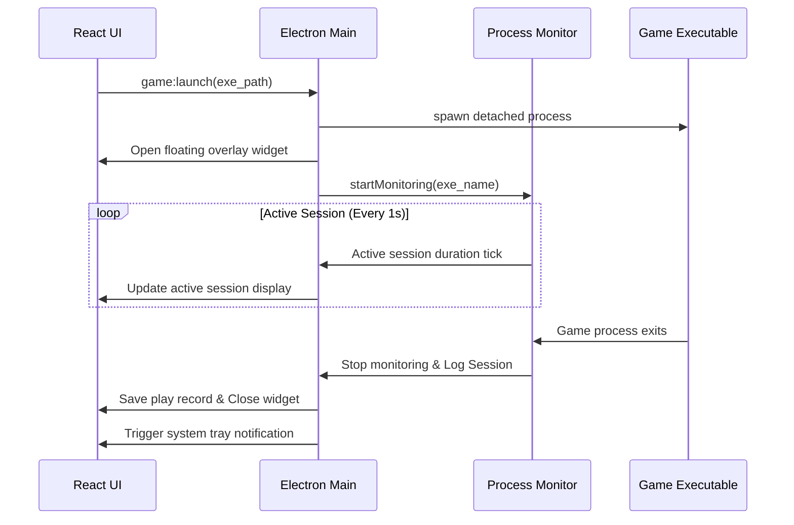

<p align="center">
  
</p>

<p align="center">
  
</p>

<p align="center">
  <strong>STRAFE — Game Library & Session Tracker</strong><br/>
  <sub>Built with Electron · React · SQLite</sub>
</p>

<p align="center">
  <a href="https://github.com/prathameshfuke/Strafe/releases/latest">
    
  </a>
  <a href="https://github.com/prathameshfuke/Strafe/releases/latest">
    
  </a>
  
  
</p>

---

> [!NOTE]
> **Windows SmartScreen Notice** — When you first run the installer, Windows may show a blue "Windows protected your PC" warning. This is normal for new apps that don't yet have a code-signing certificate. To proceed:
> 1. Click **"More info"**
> 2. Click **"Run anyway"**
>
> The app is open source — you can review every line of code in this repository.

## Core Design Philosophy


- **Warm and Tactical Aesthetic**: Clean layouts using dynamic off-whites, terracotta accents, and soft secondary amethysts. Surfaces feel like brushed metal or warm paper rather than dark neon or generic blue corporate tools.
- **Content-First Layout**: Beautiful grid and list views showing game covers, rating scales, status badges, and precise playtimes.
- **Zero Clutter**: Keyboard-first spacing feel, dense but readable sections, and smooth transition animations.

---

## System Architecture

STRAFE uses a modern multi-process architecture utilizing Electron, React, and local persistence.



---

## Features and Data Flows

### 1. Player Onboarding and Identity
Initialize a local gaming identity directly on your device. Enter your name, age, bio, and favorite genre. The onboarding flow requires zero server or third-party authentication and stores data locally. It calculates and compares your self-reported favorite genre against your auto-calculated favorite genre computed from playtime logs.

### 2. Smart Game Name Cleaning
When a game is added (manually or via file dropping), the system automatically cleans the filename and initiates a multi-stage search query.



### 3. Auto-Playtime Process Monitor
Launching a game from STRAFE spawns a detached child process, hides the main window, opens a compact overlay widget, and begins process tracking.



### 4. Goldberg achievements Integration
If you are running games using the Goldberg Steam Emulator, STRAFE watches for achievement file changes inside your local AppData directory (`%APPDATA%/Goldberg SteamEmu Saves/`). It diffs achievements in real-time, displays desktop notifications upon unlock, and records them in your profile.

### 5. The Scene (Reddit Crackwatch Feed)
An RSS parser displays the latest news and crack status from community feeds. The feed automatically cross-references entries with games in your local library and highlights matches with an "In Library" accent badge.

---

## Configuration and Setup

To get the most out of STRAFE, you can configure your preferences in the Settings page:
- **RAWG API Key**: Get a free key from RAWG.io to download real game metadata, descriptions, genres, and artwork automatically.
- **Default Directory Scanner**: Specify a default games directory (e.g. `C:\Games`). You can scan folders recursively for executables, automatically index them, and match metadata in bulk.
- **App Styling Themes**: Toggle between a warm light mode (natural off-white and terracotta) and dark mode (material charcoal and copper).

---

## Database Schema

STRAFE structures your local data across several tables:

### 1. profile Table
Stores user identity and onboarding status.
- `id`: Text (Primary Key, defaults to `user_profile`)
- `username`: Text (default: `Viper_Gamer`)
- `avatar_path`: Text
- `bio`: Text
- `status_text`: Text
- `status_type`: Text (e.g., Online, Away, DND, In-Game)
- `age`: Integer
- `favorite_genre`: Text
- `is_onboarded`: Integer (Boolean flag)

### 2. games Table
Details for each indexed game.
- `id`: Text (Primary Key)
- `name`: Text
- `exe_path`: Text
- `cover_art`: Text (local `media://` or fallback HTTP URL)
- `genre`: Text
- `developer`: Text
- `description`: Text
- `status`: Text (default: `Installed`)
- `rating`: Integer (0 to 10 scale)
- `is_favorite`: Integer (Boolean flag)
- `date_added`: Text
- `rawg_id`: Integer
- `steam_app_id`: Integer

### 3. sessions Table
Logged playtime sessions.
- `id`: Integer (Primary Key, Auto-increment)
- `game_id`: Text (Foreign Key referencing `games.id`)
- `start_time`: Text
- `end_time`: Text
- `duration_seconds`: Integer
- `notes`: Text (Journal comments)

### 4. achievements Table
badges and trophies tracked per game.
- `id`: Text (Primary Key)
- `game_id`: Text (Foreign Key referencing `games.id`)
- `name`: Text
- `description`: Text
- `rarity`: Text (Common, Rare, Epic, Legendary)
- `unlocked`: Integer (Boolean flag)
- `unlocked_date`: Text

### 5. collections Table
Custom collections created by the user.
- `id`: Text (Primary Key)
- `name`: Text
- `color`: Text (hex string)
- `icon`: Text (Lucide icon name)

### 6. collection_games Table
Many-to-many relationship mapping games to collections.
- `collection_id`: Text (Foreign Key)
- `game_id`: Text (Foreign Key)

---

## Running the Project Locally

Ensure you have Node.js installed.

### 1. Install Dependencies
```bash
npm install
```

### 2. Start Development Server
Starts the Vite dev server and launches the Electron application in hot-reload mode:
```bash
npm run dev
```

---

## Building the App

To compile the React frontend and package the Electron desktop application into a standalone Windows installer (.exe), run:

```bash
npm run package
```

The resulting setup installer will be generated inside the `release/` directory (e.g., `release/STRAFE Setup 1.0.0.exe`).

## First GitHub Release (Recommended Flow)

1. Update the app version in `package.json` (example: `1.0.0` -> `1.0.1`).
2. Commit and push changes to `main`.
3. Create and push a matching tag:

```bash
git tag v1.0.1
git push origin v1.0.1
```

Pushing a `v*` tag triggers `.github/workflows/release.yml`, which builds the Windows installer and publishes it to GitHub Releases automatically.

For a local pre-check before tagging:

```bash
npm run package:win
```

---

## Troubleshooting and Fallbacks

### SQLite Driver Compilation Fallback
If the native `better-sqlite3` module fails to load (common in environments lacking Python/C++ compiler tools), STRAFE automatically falls back to an asynchronous local JSON database (`STRAFE_fallback.json`) in the user data directory. This ensures the app is fully functional and portable across machines without requiring native compiling steps.

### Windows Symlink Extraction Error
On Windows, `electron-builder` requires Developer Mode or Administrator privileges to extract macOS symbolic links inside compiler packages. If you encounter a `Cannot create symbolic link` error, run your terminal/prompt as **Administrator** or enable **Developer Mode** under Windows Settings (Privacy & security > For developers). Alternatively, use the ZIP-folder packaging command:
```bash
npx electron-packager . STRAFE --platform=win32 --arch=x64 --out=release --overwrite --icon=icon.ico
```
